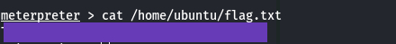

# Brains

### Task 1: Red: Exploit the Server!

**Reconnaissance phase:**

We start with a basic nmap scan of the given IP. It revealed 3 open ports.

<figure><figcaption></figcaption></figure>

By visiting the given index page of the given IP via browser.

<figure><figcaption></figcaption></figure>

On the other hand, visiting the site on port 50000 showed it is using Teamcity.

<figure><figcaption></figcaption></figure>

By researching about the particular version of the teamcity, it seems that it is vulnerable.

**`CVE-2024-27198 || CVE-2024-27199`**&#x20;

Searching for this in metasploit, we get the CVE-2024-27198 available. So i'll be using that.

<figure><figcaption></figcaption></figure>

Use the 4th exploit by running the command `use 4` or you can manually provide the name.

Set the RHOST ( Your machine IP ), LHOST ( tryhackme ip), and the port to 50000 and run exploit.

<figure><figcaption></figcaption></figure>

Running exploit creates an meterpreter session. you can view the flag in `/home/ubuntu/flag.txt`

<figure><figcaption></figcaption></figure>

Yay we found the first flag, now time to become a SOC Analyst.

&#x20;

### Task 2: Blue: Let's Investigate

Now comes the detection part.\
\
The IT department has provided us one of the servers which was compromised as a result of the attack. Our task as a Forensics Analyst is to examine the host and identify the attacker's footprints in the post-exploitation stage.

\
Let's Start the machine and see what we got..

<figure><figcaption></figcaption></figure>

Good now go to the search and reporting on the side navbar or click Search your data in the common tasks

<figure><figcaption></figcaption></figure>

Click the data summary to see the available data.

<figure><figcaption></figcaption></figure>

Click the brains host to investigate further.

**Q1: What is the name of the backdoor user which was created on the server after exploitation?**

Let's check the `auth.log` to see what are the users that were created.

Us

`source="/var/log/auth.log" sourcetype="auth_logs" "new user"`

<figure><figcaption></figcaption></figure>

There we go, got the malicicious new user.

**Q2: What is the name of the malicious-looking package installed on the server?**

While searching for the malicious package we can find a lot of package installed, so I shrinked the timeframe for about 1 week since the user was created, Changing the date&#x20;

`from jul 4 through jul 10, 2024`&#x20;

Change the search query to,

`source="/var/log/dpkg.log" sourcetype="package"`

<figure><figcaption></figcaption></figure>

Yay, time for the last question.

**Q3: What is the name of the plugin installed on the server after successful exploitation?**

In the same time frame let's search for the source type with the keyword plugin.

`source="/opt/teamcity/TeamCity/logs/teamcity-activities.log" sourcetype="teamcity_activities" "plugin"`

Hurray we got the installed plugin which was used for the exploitation.

<figure><figcaption></figcaption></figure>

Yup, we got the last flag for the ctf brains.

